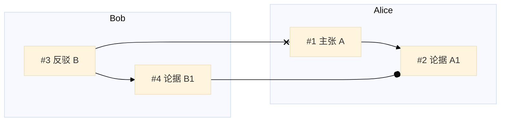

# Stream2Graph 多人观点碰撞图实现方案

## 1. 结论先行

结合当前仓库的架构与已有实现，我建议选择这条路线：

> **路线：GraphIR 语义增强 -> Flowchart 泳道化映射 -> Mermaid SVG overlay 增强**

明确不作为第一阶段主线的路线：

- 不先做 Mermaid 内核魔改
- 不先做 Mermaid 外挂 diagram
- 不先把 ELK 当作主依赖
- 不先替换整套渲染器

原因很简单：

1. 当前项目是 `GraphIR-first`，真正的“真相层”在结构图，不在 Mermaid 文本。
2. 当前 `flowchart` 路径已经打通，从 `GraphIR -> Mermaid -> SVG -> 前端交互` 是完整闭环。
3. 前端已经具备 SVG 渲染、节点测量、节点拖拽回传等能力，说明 overlay 增强可以建立在现有能力上。
4. `GraphNode / GraphEdge / GraphGroup` 已经有 `metadata`，第一阶段不需要大改 schema，就能先把“人物 / 泳道 / 轮次 / 关系类型”装进去。
5. ELK 和外挂 diagram 都不是“零成本调配置”，当前仓库没有现成接线，过早上会拖慢验证速度。

因此，最合适的实现策略是：

- **先把图语义表达对**
- **再把 Mermaid 生成模板改成更像“人物泳道图”**
- **最后在 SVG 上做视觉语法增强**

## 2. 目标效果

目标不是把图变得“更花”，而是让用户能快速回答这几类问题：

- 谁提出了哪个核心观点
- 哪些观点属于同一个人的连续论证链
- 谁在反对谁
- 哪条线是支持，哪条线是冲突
- 讨论在时间上如何推进

因此目标视觉形式应满足：

1. 人物是一级视觉主轴
2. 每个人物都有稳定 lane
3. 同一个人的观点沿 lane 顺序展开
4. 跨人物关系线可区分支持/反对/补充
5. 冲突线默认更显著
6. 局部高亮能帮助追踪复杂关系

## 3. 为什么选这条路线

### 3.1 相比 ELK 优先路线更合适

ELK 的方向是对的，但在当前项目里：

- 还没有 `@mermaid-js/layout-elk`
- 也没有 `registerLayoutLoaders(...)`
- 更重要的是，当前输入语义本身还没有表达“人物 lane / turn / relation_type”

也就是说，如果语义层还是“普通 node/edge/group”，ELK 只是把一个弱语义图排得更整齐，不会自动变成“多人观点碰撞图”。

### 3.2 相比外挂 diagram 更合适

外挂 diagram 技术上很强，但当前仓库没有任何 Mermaid plugin 基建。  
对现在这个阶段来说，它更像中长期方案，而不是最快验证用户价值的方案。

### 3.3 相比直接换渲染器更合适

完全替换渲染器虽然自由度高，但成本太大。  
当前项目已有的 Mermaid 主舞台、拖拽交互、导出能力都会被迫重做，不适合当前阶段。

## 4. 方案总览

这条路线拆成三个实现层：

### 第一层：GraphIR 语义增强

在不改 dataclass 字段定义的前提下，优先把语义放进 `metadata`。

建议新增的元信息：

- `GraphNode.metadata`
  - `speaker_id`
  - `speaker_label`
  - `lane_id`
  - `lane_index`
  - `turn_index`
  - `argument_role`
    - `claim`
    - `evidence`
    - `counter`
    - `summary`
    - `question`
  - `importance`
  - `thread_id`

- `GraphEdge.metadata`
  - `relation_type`
    - `support`
    - `attack`
    - `reply`
    - `elaborate`
    - `reference`
  - `strength`
  - `cross_lane`
  - `source_turn_index`
  - `target_turn_index`

- `GraphGroup.metadata`
  - `group_type`
    - `speaker_lane`
    - `topic_cluster`
  - `lane_index`
  - `speaker_id`
  - `speaker_label`
  - `lane_color`

- `GraphIR.metadata`
  - `view_mode: debate_lane_flowchart`
  - `time_axis_enabled`
  - `lane_order_strategy`

### 第二层：Flowchart 泳道化生成

仍然使用 Mermaid `flowchart`，但改成更接近“泳道图”的发射规则：

1. 顶层使用 `flowchart LR`
   - 横向代表不同人物 lane
2. 每个 `speaker_lane` group 生成一个 `subgraph`
3. 每个 `subgraph` 内部使用 `direction TB`
   - 纵向代表该人物的观点推进
4. 节点按 `turn_index` 排序输出
5. 边根据 `relation_type` 映射为不同边语法
6. 冲突边和支持边在样式上分化

### 第三层：SVG overlay 增强

保留 Mermaid 原始图作为底图，在前端叠加：

- lane 背景层
- lane 标题增强
- 冲突边重绘层
- hover 追踪层
- 时间刻度提示层

overlay 的职责是增强理解，不改变 GraphIR 真相层。

## 5. 具体落点到仓库文件

### 5.1 数据结构层

相关文件：

- `tools/incremental_dataset/schema.py`
- `apps/api/app/services/realtime_coordination.py`
- `tools/incremental_system/models.py`

当前情况：

- `GraphNode / GraphEdge / GraphGroup / GraphIR` 已有 `metadata`
- clone / sanitize / refine 过程中大多会保留 metadata

这很好，意味着第一阶段可以不改 schema 字段，只扩展 metadata 使用规范。

### 5.2 Mermaid 生成层

核心文件：

- `tools/incremental_dataset/staging.py`

这是本方案的第一改动重点。

当前 `flowchart` 生成逻辑大致是：

- 固定 `graph TD`
- group 变成 `subgraph`
- node 直接平铺到 group 内
- edge 一律输出 `-->`

要改成：

- 在检测到 `GraphIR.metadata.view_mode == "debate_lane_flowchart"` 时，走新的发射路径
- 顶层改为 `flowchart LR`
- 仅把 `group.metadata.group_type == "speaker_lane"` 的 group 当作主 lane
- lane 按 `lane_index` 排序
- lane 内节点按 `turn_index` 排序
- edge 按 `relation_type` 映射到不同 Mermaid 边型

建议新增辅助函数：

- `_is_debate_lane_graph(graph_ir: GraphIR) -> bool`
- `_speaker_lane_groups(graph_ir: GraphIR) -> list[GraphGroup]`
- `_sorted_lane_nodes(graph_ir: GraphIR, lane_id: str) -> list[GraphNode]`
- `_edge_syntax_for_relation(edge: GraphEdge) -> tuple[str, str]`
- `_emit_debate_lane_flowchart(graph_ir: GraphIR, ...) -> str`

建议的边语法映射：

- `attack` -> `---x`
- `support` -> `---o`
- `reply` -> `-->`
- `elaborate` -> `-.->`
- `reference` -> `==>`

注意：

- Mermaid 对某些边型在复杂场景下可能不够稳定，所以第一版允许降级到 `-->`，同时用 `classDef/linkStyle` 补足视觉区分
- 不要在第一版引入太多“隐形锚点节点”，先看纯 lane 化模板效果

## 6. Flowchart 泳道模板建议

建议发射结构如下：

这个模板和你当前仓库最兼容，因为：

- 还是 flowchart
- 还是 subgraph
- 只是把 group 从“装饰分组”提升成“lane 主轴”

## 7. 前端 overlay 方案

### 7.1 核心文件

- `apps/web/components/mermaid-card.tsx`
- `apps/web/components/realtime-studio.tsx`

### 7.2 当前基础能力

前端已经有这些可复用能力：

- 可以拿到 Mermaid 生成的 SVG
- 可以遍历 `g.node` 和 `g.cluster`
- 可以测量节点和 group 的位置
- 可以在拖拽时生成空间摘要

所以 overlay 实现不需要从零搭。

### 7.3 需要新增的能力

当前 `MermaidGraphPayload` 类型只有：

- `nodes`
- `groups`

建议扩展为：

- `nodes`
- `groups`
- `edges`
- `metadata`

原因：

- overlay 不只要知道 node/group
- 还要知道 edge 的 `relation_type`
- 还要知道 lane 的颜色和排序

建议新增类型：

- `MermaidGraphEdge`
  - `id`
  - `source`
  - `target`
  - `label`
  - `kind`
  - `metadata`

### 7.4 Overlay 分层结构

建议在 `renderSurfaceRef` 挂载后，给 SVG 注入 3 个附加 layer：

1. `lane-underlay`
   - 在 `g.cluster` 下方画 lane 背景
   - 颜色从 `group.metadata.lane_color` 读取

2. `relation-overlay`
   - 对 `attack/support` 边做二次高亮
   - 初版不一定重绘所有 path，可以先做“描边增强 + hover 高亮”

3. `focus-overlay`
   - hover 节点时，只高亮和该节点相关的 lane、边、邻居节点

### 7.5 第一版 overlay 不建议做的事

第一版不要做这些高成本操作：

- 不要完全隐藏 Mermaid 原始边再全部重绘
- 不要做复杂 bridge/edge bundling
- 不要做 sticky lane label 跟随复杂 pan/zoom
- 不要做局部二次布局

第一版只做：

- lane 背景
- lane 视觉强化
- semantic edge 高亮
- hover path tracing

这样风险最低，也最容易验收。

## 8. 具体代码改造建议

### 阶段 A：只改后端生成模板

目标：

- 不动前端 overlay
- 先看 lane flowchart 本身能提升多少可读性

改动：

- `tools/incremental_dataset/staging.py`
  - 增加 debate lane flowchart 发射路径

验证：

- 选 3 份多人讨论样例
- 看 lane 是否稳定
- 看跨人物关系是否更容易追踪

### 阶段 B：前端加入 lane overlay

目标：

- 让人物 lane 更显眼

改动：

- `apps/web/components/mermaid-card.tsx`
  - SVG 渲染成功后注入 lane underlay
  - 用 `g.cluster` bbox 绘制背景矩形

验证：

- 放大缩小时是否稳定
- 重渲染后 overlay 是否正常重建

### 阶段 C：加入 semantic edge highlight

目标：

- 冲突线、支持线在视觉上明显不同

改动：

- 扩展 `MermaidGraphPayload` 类型
- 从 `realtime-studio.tsx` 向 `MermaidCard` 传完整 edge 元信息
- 在 `MermaidCard` 内基于 edge metadata 添加高亮层

验证：

- hover 某节点时，attack/support 路径能否准确追踪

### 阶段 D：补充时间表达

目标：

- 让用户更容易理解观点演化顺序

实现建议：

- 第一版直接把 `turn_index` 作为节点标签前缀
- 不先引入单独 timeline Mermaid 图

原因：

- 最低成本
- 与主图阅读最直接
- 不新增第二套组件负担

## 9. API 和状态层需要注意的点

### 9.1 尽量不改 API contract

当前 `graph_state.current_graph_ir` 已经会传到前端。  
第一阶段尽量只往其中的 `metadata` 塞新语义，不改接口外形。

这样可以降低：

- 前后端 schema 改动面
- 历史 report 兼容风险
- snapshot/replay 风险

### 9.2 delta_ops 当前不会携带 metadata

当前 `_graph_delta(...)` 生成的 `add_node / add_edge / add_group` 只带基础字段，不带 metadata。

这意味着：

- 如果后续你想做“增量级的 lane 语义追踪”，要么扩展 delta_ops
- 要么继续依赖完整 `current_graph_ir` 作为前端真相层

在第一阶段里，建议继续依赖完整 `current_graph_ir`，不要先碰 delta 协议。

## 10. 测试策略

### 10.1 后端测试

新增测试文件建议：

- `apps/api/tests/test_debate_lane_mermaid.py`

覆盖：

- lane group 排序正确
- lane 内节点按 turn 排序
- `attack/support` 边正确映射
- 普通 flowchart 不受影响

### 10.2 前端测试

当前前端没有完整测试体系，所以第一阶段建议用：

- 约定样例回归
- 导出 SVG snapshot
- 人工视觉检查

至少保留：

- 小图
- 中图
- 大图
- 跨 lane 高频 attack 样例

## 11. 验收标准

建议这样验收，而不是只看“好不好看”：

### 可读性

- 给定 3 人对话样例，用户能快速指出：
  - Alice 的主张链
  - Bob 对 Alice 的反对链
  - 哪些边是支持，哪些边是冲突

### 工程可控性

- 不引入 Mermaid 内核 fork
- 不引入第二套主渲染框架
- 不破坏现有拖拽 relayout

### 性能

- 中等规模图重渲染无明显卡顿
- overlay 增强不会显著增加前端交互延迟

## 12. 推荐排期

### 第 1 周

- 定义 metadata 规范
- 在 `staging.py` 做 lane flowchart 分支
- 准备回归样例

### 第 2 周

- 落地 lane flowchart
- 调整 classDef 与样式
- 验证 3 组样例

### 第 3 周

- 在 `MermaidCard` 加 lane overlay
- 做 hover lane focus

### 第 4 周

- 加 semantic edge highlight
- 评估是否还有必要接 ELK

## 13. 是否需要 ELK

本路线不是拒绝 ELK，而是把 ELK 放到第二阶段决策点。

只有当出现以下情况时，才建议继续接 ELK：

1. lane flowchart 已经成型
2. overlay 也已经有基础效果
3. 但跨 lane 边交叉仍然严重影响理解

这时再做 ELK PoC，收益才是清晰可测的。

## 14. 最后的建议

这条路线最核心的原则是：

> 不先追求“最强渲染器”，而是先把“多人观点碰撞”的语义结构表达对。

对当前 `Stream2Graph` 来说，最值得先做的不是“更换 Mermaid”，而是：

- 把人物变成主轴
- 把观点推进变成可追踪的 lane
- 把支持/反对关系做成默认显著的视觉对象

如果这一版做出来已经明显改善用户理解，那么后面的 ELK、外挂 diagram、替换渲染器，都会变成“增强项”，而不是“救命项”。
